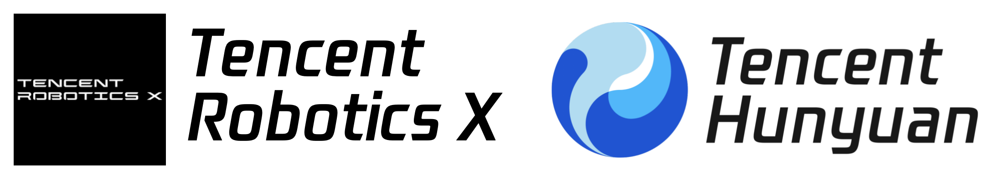
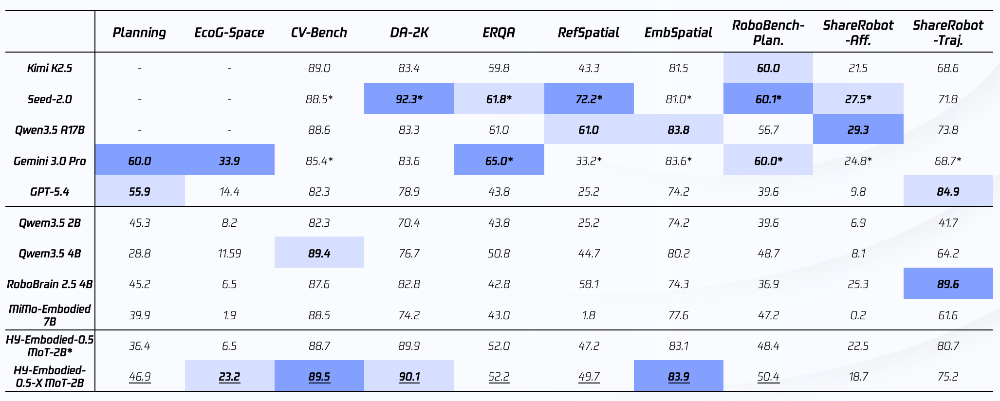
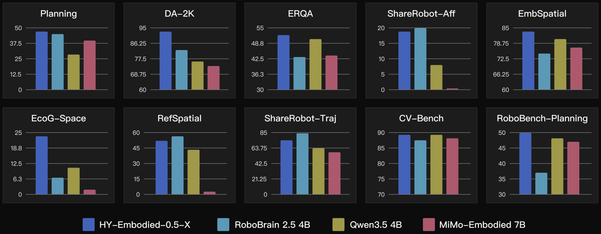
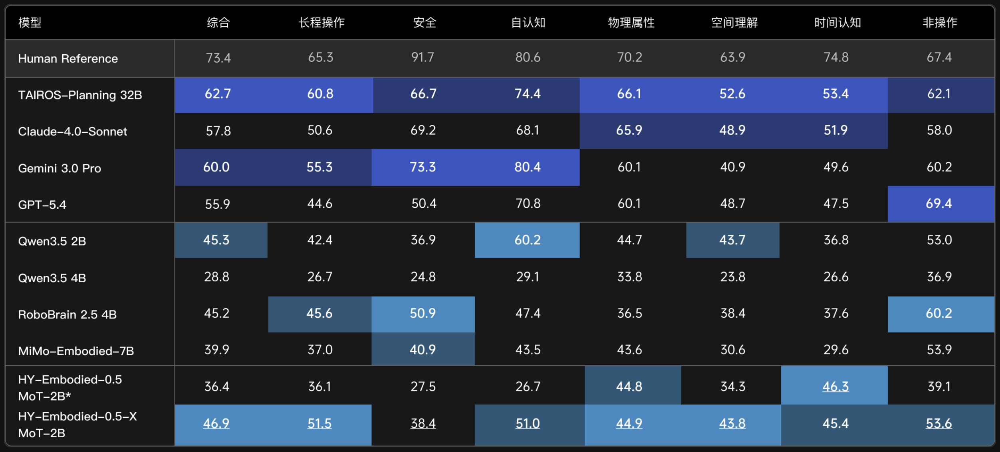

# HY-Embodied-0.5-X

### An Embodied Multimodal Foundation Model for Real-World Robotics

*Tencent Robotics X × HY Vision Team*

<p align="center">
  
</p>

<p align="center">
  <a href="https://tairos.tencent.com/openSourceModels/hy-embodied"></a>
  <a href="https://huggingface.co/tencent/HY-Embodied-0.5-X"></a>
  <a href="https://github.com/Tencent-Hunyuan/HY-Embodied-0.5-X"></a>
  <a href="https://tairos.tencent.com/"></a>
  <a href="./README_zn.md"></a>
  <a href="./docs"></a>
</p>

---

**HY-Embodied-0.5-X** is an enhanced open-source embodied multimodal foundation model
jointly released by Tencent Robotics X and the HY Vision Team. Built on
top of the `HY-Embodied-0.5 MoT-2B` architecture (4B total parameters with
only 2B activated), it is specifically optimized for the core loop of
real-world robotics — **"understand, reason, and act"**.

The model reaches state-of-the-art performance on **10 mainstream embodied
task-planning benchmarks**, ranking **1st among edge-side domain models on
7 of them**. Compared with general-purpose multimodal models,
HY-Embodied-0.5-X focuses more tightly on the problems that matter in
real-world robot interaction, with dedicated improvements in **fine-grained
manipulation understanding, spatial reasoning, action prediction, risk
assessment, multimodal reference grounding, and long-horizon planning** —
pushing the model from *"seeing"* to *"doing"*.

## 🔥 Updates

- **`[2026-04-24]`** 🚀 Released **HY-Embodied-0.5-X**, an embodied-focused
  enhancement on top of HY-Embodied-0.5 MoT-2B, together with inference
  and training code.

## ⭐️ Key Features

1. 🧠 **Stronger Spatial Understanding** — accurately reasons about object
   positions, scene layout, relative spatial relations, and manipulation
   states, providing a reliable perceptual basis for action decisions.
2. 🔗 **Stronger Long-Horizon Planning** — handles multi-step,
   strongly-dependent complex tasks, producing stable task decomposition,
   action planning, and execution decisions across continuous
   interactions.
3. 🤖 **Stronger Embodied Interaction** — beyond visual understanding and
   dialogue, supports task parsing, reference resolution, action
   decisions, risk judgement, and failure reflection, closely matching the
   real robot interaction loop.
4. 📦 **Edge-Friendly** — built on the MoT-2B architecture (4B total / 2B
   activated), suitable for on-device deployment and real-time response.

## 📖 Model Highlights

### 1. Rich and Reliable Data Composition

HY-Embodied-0.5-X combines **self-collected first-person robot manipulation
data, robotic-arm manipulation data, and open-source embodied data** into a
high-quality corpus that covers manipulation understanding, first-person
task reasoning, and multimodal reference grounding:

- **Robotic-arm / human-hand trajectories** — dedicated data for state
  understanding, next-action prediction, manipulation-risk assessment,
  failure diagnosis, and pairwise candidate-action comparison.
- **First-person embodied tasks** — fine-grained action recognition,
  subtask progress estimation, hand spatial localization, depth
  estimation, relative spatial reasoning, camera pose inference, and more.
- **Multimodal interactive reference grounding** — data built around
  ambiguous real-world instructions such as *"put this over there"*,
  combining speech and gesture cues.

All core samples are paired with **chain-of-thought (CoT) annotations** and
a full **"generate → verify → correct → eval-regression"** data-quality
loop. Embodied, internet, and 3D data are further unified through a
standardized reconstruction pipeline that turns heterogeneous sources into
consistent, high-quality embodied reasoning data.

### 2. "Validate → Scale → Full-Run" Training Strategy

Training follows a staged iterative strategy:

1. Quickly validate training configs and data cleaning on a small,
   high-quality subset.
2. Progressively scale up training data and compute.
3. Kick off full-scale training only after the optimal data mix and
   training strategy are confirmed.

This ensures each unit of compute is invested in the most valuable data.

## 📊 Evaluation

### Overall Benchmark Results

Across **10 open-source benchmarks** covering planning, spatial reasoning,
embodied QA, visual reference, and trajectory understanding,
HY-Embodied-0.5-X stays in the top tier.

<p align="center">
  
</p>

### Comparison with Same-Size Open-Source Models

<p align="center">
  
</p>

### AI2Thor Embodied Planning Benchmark

We built an internal embodied-planning benchmark on AI2Thor with **1,011
tasks** across four household scenes (kitchen, bedroom, living room,
bathroom), evaluating planning and execution on navigation, grasping,
placement, appliance operation, and food cutting. HY-Embodied-0.5-X shows
clear gains on long-horizon manipulation, self-awareness, and spatial
understanding:

<p align="center">
  
</p>

### PlaygroundX Simulation Integration

HY-Embodied-0.5-X is integrated with the **PlaygroundX** simulation
framework (built on Tairos). It produces full plans for household
instructions such as *"throw the potato into the trash"*, *"close the
fridge door"*, or *"put the tomato in the fridge"*, and adjusts execution
based on environmental feedback — including on-the-fly replanning when an
initial plan fails, forming a complete **ReAct loop**: *reason → execute →
detect failure → replan*.

## 🛠️ Installation

A one-click conda setup script `setup_env.sh` is provided. It creates the
environment, installs PyTorch / flash_attn / transformers (native
HY-Embodied support) / and all remaining dependencies. `flash_attn`
compiles from source and takes ~10–20 minutes:

```bash
bash setup_env.sh
conda activate hy_embodied_x

# (optional) expose the package as a console script
pip install -e .
```

### Prerequisites

| Item    | Requirement                     |
|---------|---------------------------------|
| OS      | Linux                           |
| Python  | 3.12                            |
| CUDA    | 12.6                            |
| PyTorch | 2.10.0                          |
| GPU     | NVIDIA GPU with ≥ 16 GB VRAM    |

> Key dependencies: `transformers` ([specific commit](https://github.com/huggingface/transformers/commit/9293856c419762ebf98fbe2bd9440f9ce7069f1a), native HY-Embodied support),
> `flash_attn==2.8.3`, `accelerate`, `deepspeed`, `timm`, `liger-kernel`.
> See `setup_env.sh` and `requirements.txt` for the pinned list.

## 📥 Downloading the Weights

```bash
hf download tencent/HY-Embodied-0.5-X \
    --local-dir ckpts/HY-Embodied-0.5-X
```

Weights (`*.safetensors`) are git-ignored and expected under
`ckpts/HY-Embodied-0.5-X/`. The inference and training code also accepts
the Hub repo id directly, which triggers on-demand download via
`transformers`.

## 🚀 Quick Start

### Single-image inference

```bash
python -m hy_embodied.cli.infer \
    --model ckpts/HY-Embodied-0.5-X \
    --image ./assets/demo.jpg \
    --prompt "Describe this image"

# Disable thinking mode
python -m hy_embodied.cli.infer \
    --model ckpts/HY-Embodied-0.5-X \
    --image ./assets/demo.jpg \
    --prompt "Describe this image" \
    --no-thinking
```

The legacy `python inference.py ...` invocation also works (it forwards to
the same code path).

### Python API

```python
import torch
from hy_embodied.inference import GenerationConfig, HyEmbodiedPipeline

pipe = HyEmbodiedPipeline.from_pretrained(
    "ckpts/HY-Embodied-0.5-X",
    device="cuda",
    torch_dtype=torch.bfloat16,
)

print(pipe.generate(
    "Describe the image in detail.",
    image="./assets/demo.jpg",
    generation_config=GenerationConfig(max_new_tokens=32768, temperature=0.05),
))
```

See [`docs/inference.md`](./docs/inference.md) for batch inference and
multi-image / video examples.

### OpenAI-compatible API Server

Launch a server that exposes the standard `/v1/chat/completions` endpoint:

```bash
# Quick start
bash scripts/run_server.sh

# Or with custom options
python -m hy_embodied.cli.server \
    --model ckpts/HY-Embodied-0.5-X \
    --host 0.0.0.0 --port 8080

# After `pip install -e ".[serve]"`
hy-embodied-server --model ckpts/HY-Embodied-0.5-X --port 8080
```

Then use any OpenAI-compatible client to call the model:

```python
from openai import OpenAI

client = OpenAI(base_url="http://localhost:8080/v1", api_key="any")

# Text-only
resp = client.chat.completions.create(
    model="HY-Embodied-0.5-X",
    messages=[{"role": "user", "content": "How to open a fridge?"}],
)
print(resp.choices[0].message.content)

# With image
resp = client.chat.completions.create(
    model="HY-Embodied-0.5-X",
    messages=[{
        "role": "user",
        "content": [
            {"type": "image_url", "image_url": {"url": "https://example.com/img.jpg"}},
            {"type": "text", "text": "Describe this image."},
        ],
    }],
)

# Streaming
stream = client.chat.completions.create(
    model="HY-Embodied-0.5-X",
    messages=[{"role": "user", "content": "Plan how to clean the table."}],
    stream=True,
)
for chunk in stream:
    if chunk.choices[0].delta.content:
        print(chunk.choices[0].delta.content, end="", flush=True)
```

Supports `curl` as well:

```bash
curl http://localhost:8080/v1/chat/completions \
  -H "Content-Type: application/json" \
  -d '{
    "model": "HY-Embodied-0.5-X",
    "messages": [{"role":"user","content":"Hello!"}]
  }'
```

See [`docs/inference.md`](./docs/inference.md) for full server documentation.

### SFT fine-tuning

```bash
# Single GPU smoke test — no torchrun / DeepSpeed required (≥ 16 GB VRAM)
CUDA_VISIBLE_DEVICES=0 python -m hy_embodied.cli.train \
    --config configs/sft/example_small_single_gpu.yaml
# or simply:
bash scripts/run_sft_single_gpu.sh

# 1 node × 8 GPUs with DeepSpeed ZeRO-2
bash scripts/run_sft_1node_8gpu.sh

# 4 nodes × 8 GPUs
bash scripts/run_sft_4node_8gpu.sh
```

Two reference configs are shipped:

- `configs/sft/example_small_single_gpu.yaml` — **single-GPU config** with
  DeepSpeed disabled. Can be launched with plain `python -m` (no `torchrun`
  needed). Best for quick validation and debugging.
- `configs/sft/example_small.yaml` — **multi-GPU config** with DeepSpeed
  ZeRO-2 enabled. Must be launched via `torchrun` or `accelerate`. Its
  training/optimizer defaults match the release recipe; new users typically
  only need to edit `data.train_data_paths` /
  `data.train_data_sampling_ratios` to point at their own JSONL mixture.

Both configs ship with `data_examples/data_demo.jsonl` (14 samples across
6 capabilities, images bundled in the repo) so the default commands run
end-to-end with no external data.

See [`docs/training.md`](./docs/training.md) for the config reference and
distributed strategies.

### Coordinate & response format

- **Point**: `(x, y)` or `[(x1, y1), (x2, y2)]`
- **Box**: `[xmin, ymin, xmax, ymax]`
- Coordinates are normalized to the integer range **(0, 1000)**.
- In thinking mode, the response is structured as
  `<think>[reasoning]</think><answer>[answer]</answer>`.

## 📁 Repository Layout

```
HY-Embodied-0.5-X/
├── README.md                 # this file
├── LICENSE                   # Apache-2.0
├── pyproject.toml            # packaging + console scripts
├── requirements.txt          # full pinned dependency list
├── setup_env.sh              # one-click env setup
│
├── src/hy_embodied/          # Python package
│   ├── cli/                  # `python -m hy_embodied.cli.train / .infer / .server`
│   ├── training/             # SFT trainer, data pipeline, chat template
│   └── inference/            # HyEmbodiedPipeline
│
├── configs/
│   ├── sft/                  # training config (example_small.yaml)
│   ├── accelerate/           # accelerate launcher configs
│   ├── deepspeed/            # ZeRO configs
│   └── fsdp/                 # FSDP configs
│
├── scripts/                  # shell launchers (1-node / 4-node)
├── data_examples/            # per-capability sample JSONLs (+ README)
├── docs/                     # data_format / training / inference / architecture
├── assets/                   # images used in docs / README
├── ckpts/                    # (gitignored) `hf download` target
├── outputs/                  # (gitignored) training run outputs
└── inference.py              # backward-compat shim for the legacy CLI
```

See [`docs/architecture.md`](./docs/architecture.md) for the architectural
rationale and dependency rules.

## 🎯 Use Cases

HY-Embodied-0.5-X targets the following embodied scenarios:

- **Home service / tabletop manipulation** — spatial reasoning,
  fine-grained manipulation reasoning, task understanding, and failure
  reflection in real environments.
- **Task planning & simulation evaluation** — planning evaluation and
  multimodal interaction research in simulated settings.
- **Local deployment & development** — on-device validation and downstream
  development of embodied capabilities.

## 📚 Citation

```bibtex
@article{tencent2026hyembodied05x,
  title   = {HY-Embodied-0.5-X: An Enhanced Embodied Foundation Model for Real-World Agents},
  author  = {Tencent Robotics X and HY Vision Team},
  year    = {2026}
}
```

## 🙏 Acknowledgements

Thanks to the Hugging Face
community, and all open-source contributors. By open-sourcing
HY-Embodied-0.5-X we hope to offer the embodied-AI community a more
deployment-oriented foundation, and to push models from *general
understanding* toward *real-world execution*.
